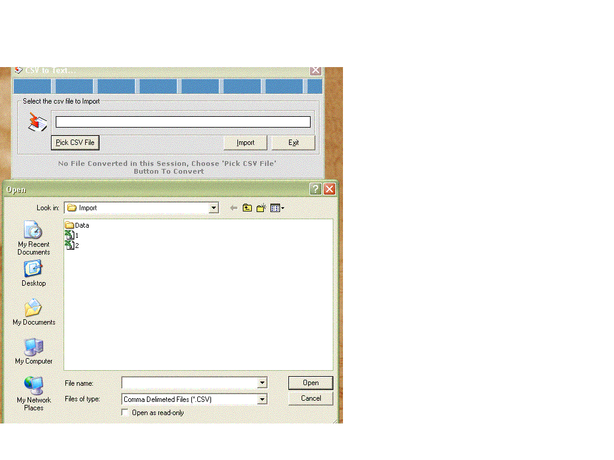



## CSV to Text File Converter Version 2

### Description

Hey Friends As promised due to your good response i am uploading the next version of the CSV to Text File Converter. This new version will sort the text file data in either ascending or descending format.

I thought of sharing this program with you all. Converting CSV files to Text Files as per customisation required. I was using this small project to convert the CSV file i have into different text files. The name of the text file use to be the same as the first column in the csv. Rest all corresponding data goes to the subsequent files and gets append to it. For Example : when i run three different CSV's then all the for the first column named "UNIVERSAL" gets logged into one text file named UNIVERSAL.txt....

similar others data are getting appended.

01/01/2003,81,81.5,79.3,80,9848 01/06/2003,81,81.5,79.3,80,9848 02/06/2003,81,81.5,79.3,80,9848

----

As the database format is big i would like request whosoever use this code to create a Access Database . Following are the Inputs

Database Name : Import.mdb

Table Name : TImport

Fields Name : Field1 , Field2 , Field3 , Field4 ,

Field5, Field6

I will be soon giving you with the new version of it only if the response is good. Email me your suggestions and feedback @ universalprogrammer@indiatimes.com
 
### More Info
 
As the database format is big i would like request whosoever use this code to create a Access Database . Following are the Inputs

Database Name : Import.mdb

Table Name : TImport

Fields Name : Field1 , Field2 , Field3 , Field4 ,

Field5, Field6

This project was done for Stock Exchange Agent, for sorting their daily data.

As the database format is big i would like request whosoever use this code to create a Access Database . Following are the Inputs

Database Name : Import.mdb

Table Name : TImport

Fields Name : Field1 , Field2 , Field3 , Field4 ,

Field5, Field6

Will Convert all the CSV data to its corresponding text file name(as per the first column.)and will sort the text file data in either ascending or descending format.

             |
---                |---
**Submitted On**   |2004-01-02 18:31:16
**By**             |[Universal Kida](https://github.com/Planet-Source-Code/PSCIndex/blob/master/ByAuthor/universal-kida.md)
**Level**          |Advanced
**User Rating**    |4.8 (38 globes from 8 users)
**Compatibility**  |VB 6\.0, VBA MS Access
**Category**       |[Complete Applications](https://github.com/Planet-Source-Code/PSCIndex/blob/master/ByCategory/complete-applications__1-27.md)
**World**          |[Visual Basic](https://github.com/Planet-Source-Code/PSCIndex/blob/master/ByWorld/visual-basic.md)
**Archive File**   |[CSV\_to\_Tex170275212004\.zip](https://github.com/Planet-Source-Code/universal-kida-csv-to-text-file-converter-version-2__1-51417/archive/master.zip)

